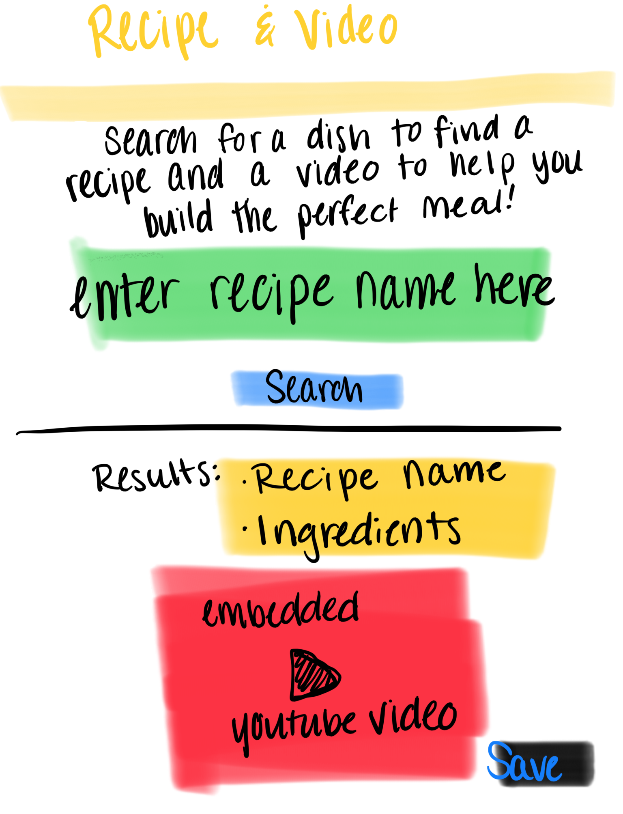

# Recipe and Video Project

# Overview

This mobile-first application allows the user to easily search for a dish using two API's. The search results provide:
* The title of the dish
* Ingredients needed
* A YouTube video about the meal

The title and ingredients are provided by the Edamam API.
The Youtube video is embedded into the webpage and the search results are accessed through the YouTube Search API.

# Project Process

Before starting our project, we created a flow chart and a rough sketch of our webpage design. 
*Workflow Chart: 
*Rough sketch of homepage: 

Using these tools, we were able to create a user friendly page to showcase the results of the API's used.

# Mock-Up and Link to Page:

Below is a representation of what the application looks like when deployed:

Click the link to access the full applicaiton: 

https://audreymking.github.io/Recipe-Project/

Created by Matthew Heering, Audrey King, and Daniel Mehrmann
